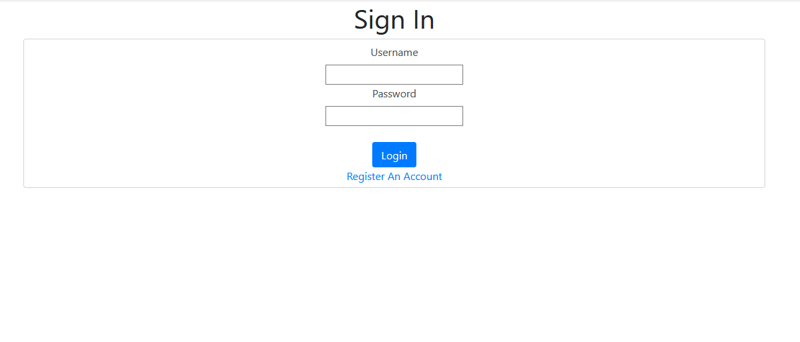
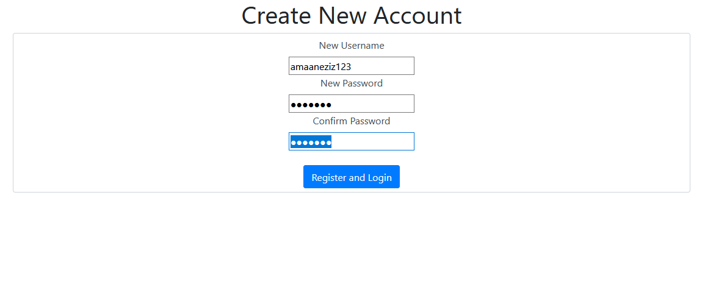
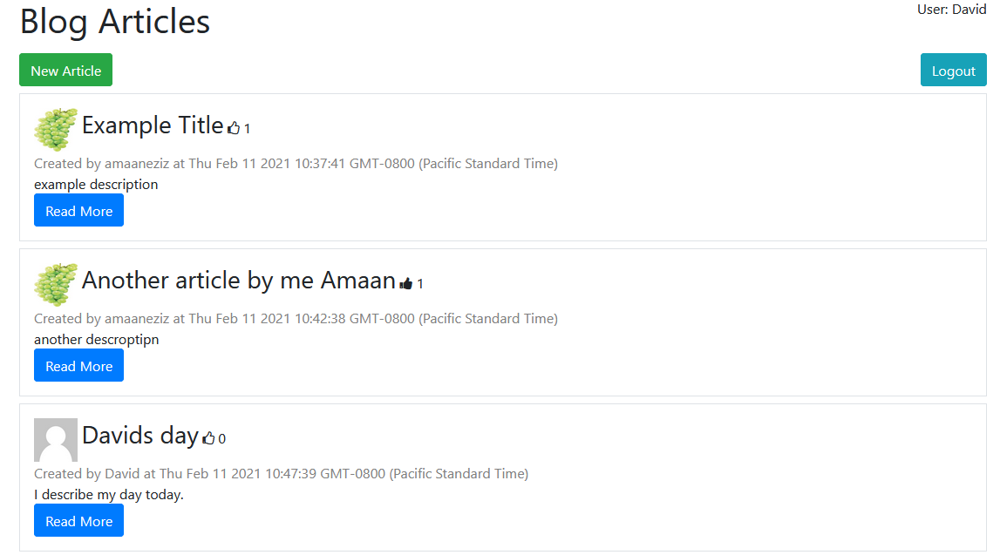
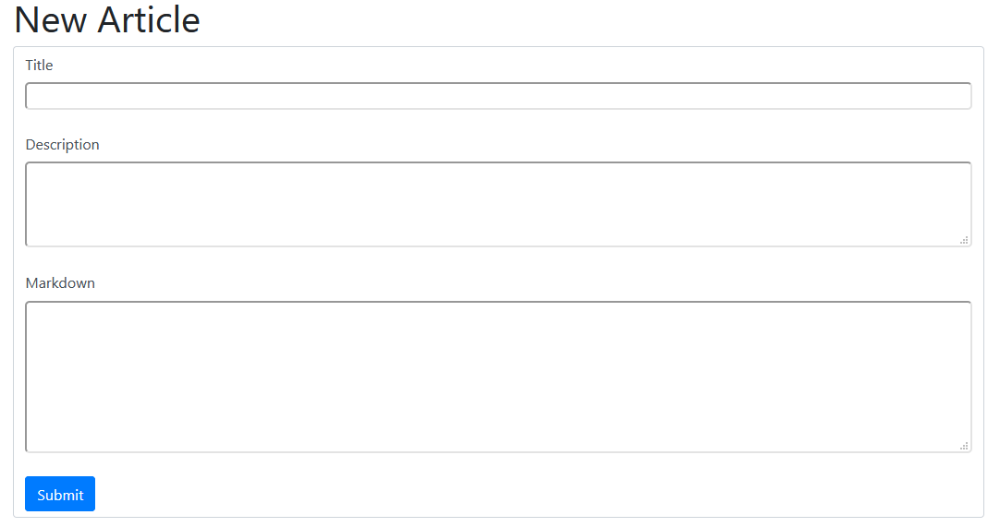
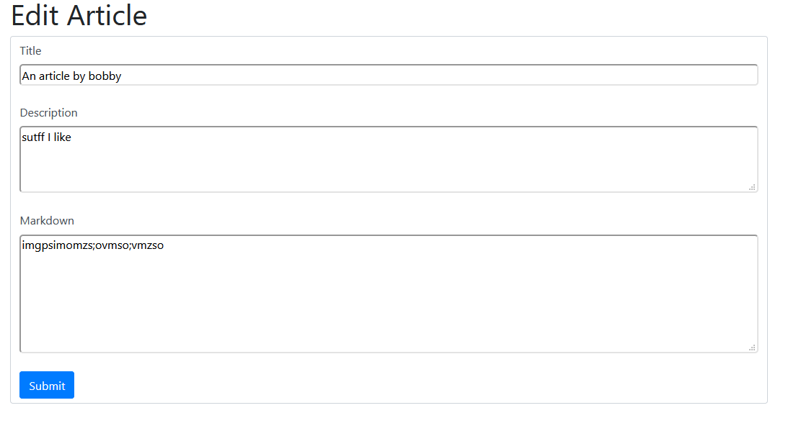
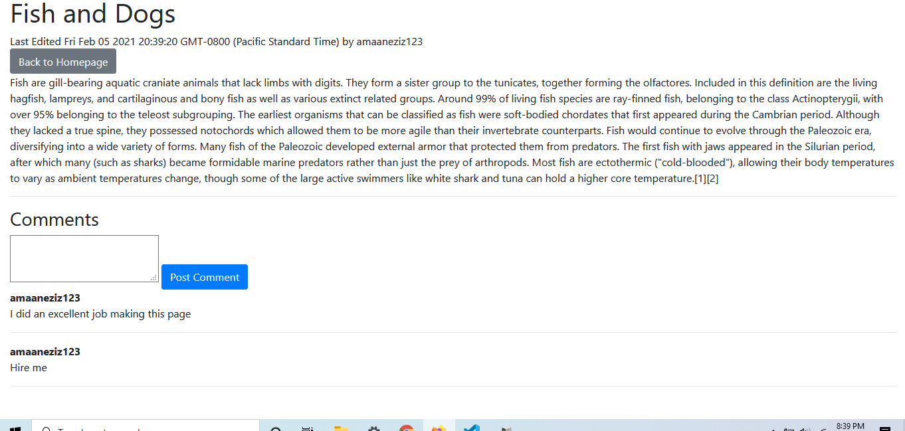
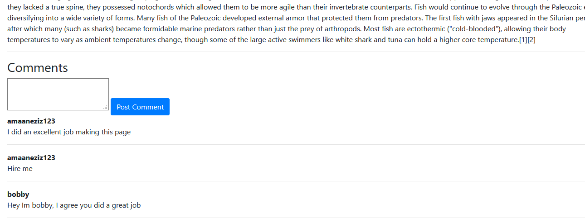

This full stack blog web site allows users to sign in or create an account and sign in, post new blogs,
edit/delete their blogs, comment on their own blogs as well as other users' blogs, and more. This project
uses nodeJS/expressJS for the server side, mongoDB for the database, and regular EJS for the front-end.

SignIn:
  

Registration
  

Homepage:
  

New Article:
  

Required New Article Fields:
  

Edit Article:
  

Read More:
  

Comments:
  

