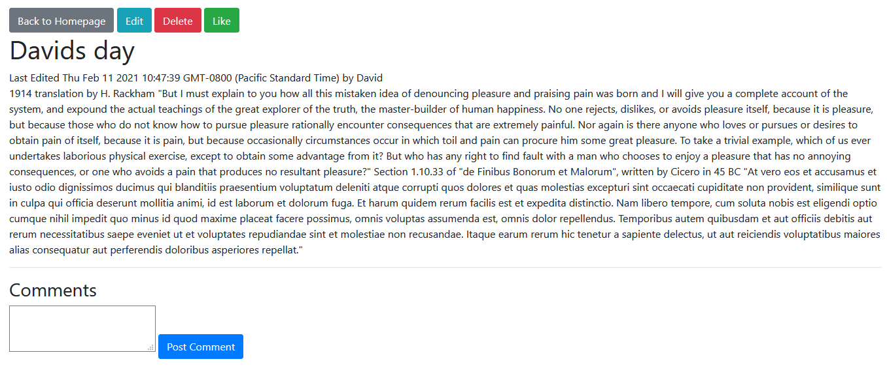
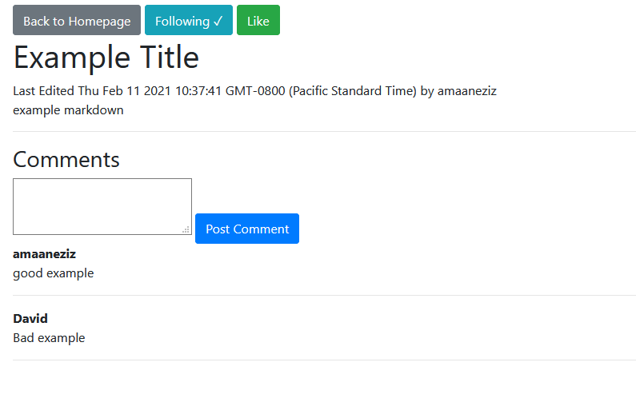

This full stack blog web site allows users to sign in or create an account, post new blogs,
edit/delete their blogs, comment on their own blogs as well as other users' blogs, follow other
users, view profile pages, edit their own profile page,and more. This project uses nodeJS/expressJS 
for the server side, mongoDB for the database, and regular EJS for the front-end.

SignIn:
  

Registration
  

Homepage:
  

New Article:
  

Edit Article:
  

Article Page as Author:
  

Article Page as Viewer (non-author)
  

Profile Page:
  

Edit Profile Page:
  